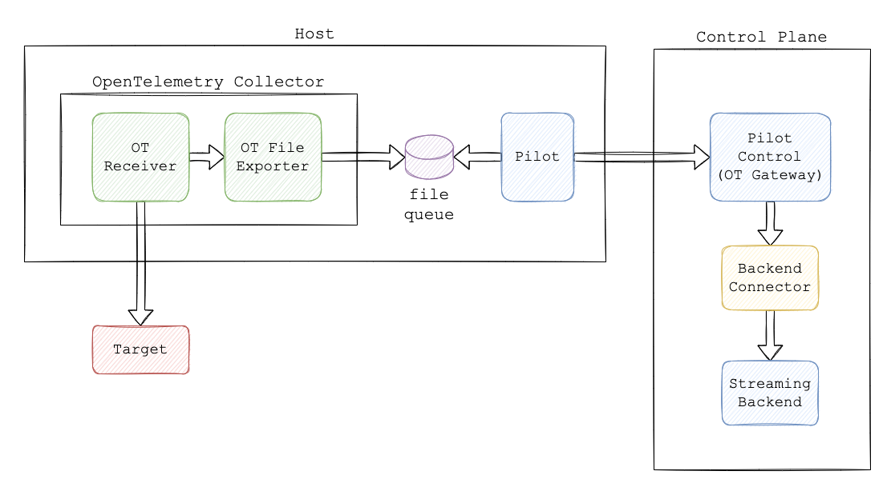

# Pilot Control Telemetry Router

Pilot Control provides an Open Telemetry Gateway that is used to ingest metrics sent by Pilot agents.

The gateway uses the [Open Telemetry Protocol](https://opentelemetry.io/docs/reference/specification/protocol/otlp/) to encode, transport, and deliver telemetry data between pilot agents and this telemetry backend.

Pilot Control can then send the telemetry to a backend for processing. Only one processing backend can be configure at any  point in time.

The following figure shows the process of collecting telemetry:

An [Open Telemetry collector](https://github.com/open-telemetry/opentelemetry-collector) collects metrics and using a file exporter saves them in a persistent file queue. This is done to prevent losing telemetry information if the device or the network goe down.

The pilot agent in the device inspect the queue and exports the metrics to pilot control that acts as an Open Telemetry gateway.

Pilot control hands the information over to a connector that in turn transfer the telemetry to a designated streaming backend.